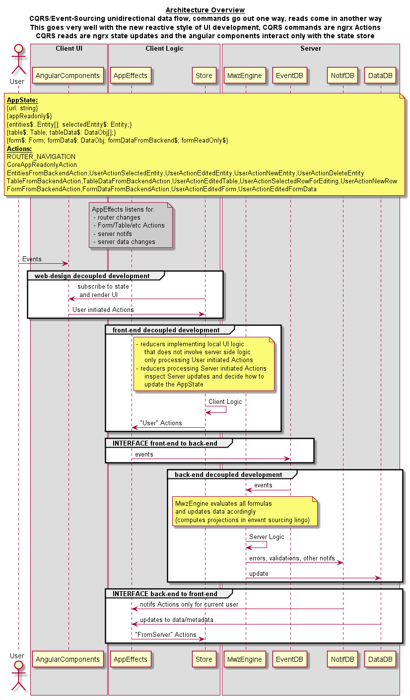
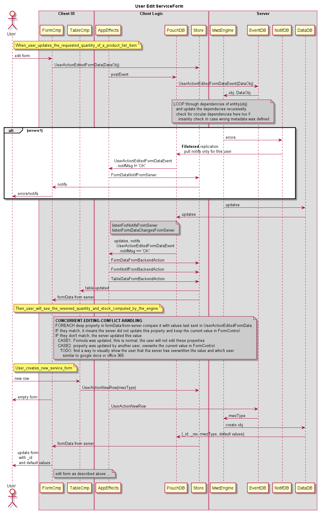
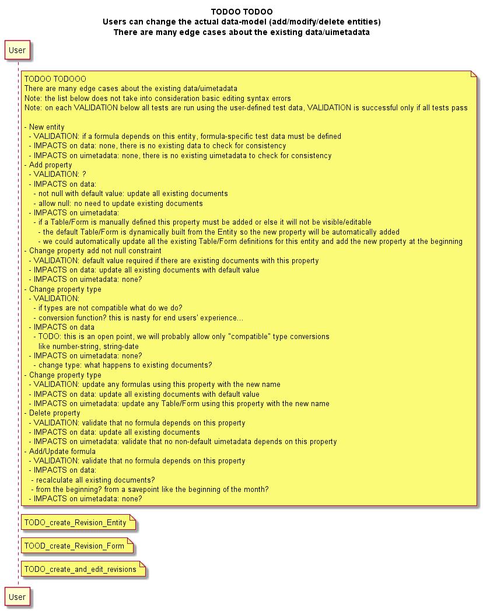

# Febe

This project was generated with [Angular CLI](https://github.com/angular/angular-cli) version 1.4.3.

## 1. Development

### 1.1 Setting up CouchDB and test data

Install docker toolbox: https://www.docker.com/products/docker-toolbox

        docker-machine.exe create docker2
        eval $(docker-machine.exe env docker2 --shell bash)
        docker build -t mycouchdb .
        MSYS_NO_PATHCONV=1 docker run --privileged -d --name cdb -p 5984:5984 mycouchdb

        IGNORE NETWORK SHAPING FOR NOW...it does not work
        docker exec -it cdb tc qdisc change dev eth0 root netem delay 150ms
        RTNETLINK answers: No such file or directory... WTF!!!! ignore for now, but we should really test with high latency and low throughput network links, developing and testing at loopback network speed is asking for trouble !!!!
        
        /wondershaper.sh -a eth0 -d 256 -u 256 #also does not work WTF
        # we should use trickle for user-space traffic shaping

        VBoxManage controlvm "docker2" natpf1 "couchdb,tcp,,5984,,5984"

Then follow:
http://docs.couchdb.org/en/master/install/setup.html#single-node-setup

Then Create 2 new databases called 'mwzdata' and 'mwzevents'

Then load test data:

        ./node_modules/.bin/tsc # compile the test data loader
        node dist/out-tsc/src/app/test/mocks/loadTestData.js

## 1.2 Running 

Run `ng serve` for a dev server. Navigate to `http://localhost:4200/`. The app will automatically reload if you change any of the source files.

### Other usual commands

Run `ng generate component component-name` to generate a new component. You can also use `ng generate directive|pipe|service|class|guard|interface|enum|module`.

Run `ng test -w` to execute the unit tests via [Karma](https://karma-runner.github.io).

Run `ng build` to build the project. The build artifacts will be stored in the `dist/` directory. Use the `-prod` flag for a production build.

Run `ng e2e` to execute the end-to-end tests via [Protractor](http://www.protractortest.org/).

## 1.3 Design

"Everyting is a stream" design goals...before you find some hate/pain points give me a chance to explain the benefits :)

# 2. Production

TODO

