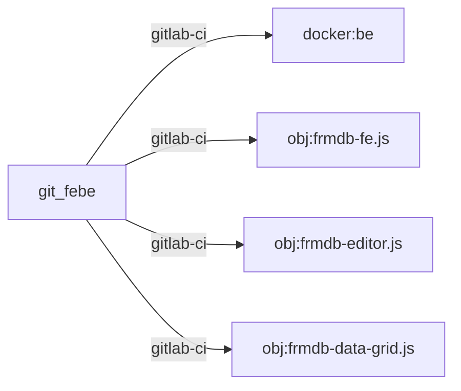

FormulaDB apps could be plain HTML/CSS/JS web apps:

* [ ]  A `Page` is vanilla `HTML`
* [ ]  An `Entity` is `JSON, Schema - like`: proprietary FormulaDB format
* [ ]  An `Formula` is a `string`: proprietary FormulaDB format
* [ ]  An `DataObj` is plain `JSON` object conforming to `Entity` definition
* [ ]  A `TableObj` an `Array` with `DataObj` from a `Entity`
* [ ]  `Page editor`: plain HTML website builder https://github.com/givanz/VvvebJs
* [ ]  `EntityEditor` already developed as an Angular app (most notable external dependency: `ag-grid`)
* [ ]  `Pages` visualize `DataObj` and `TableObj`: valid HTML template engine http://leonidas.github.io/transparency/
* `Pages` should allow editing of `DataObj` and `TableObj`
  * [ ]  Scalar form events from `input, select`
  * [ ]  Navigate+Edit to a `DataObj' in a `TableObj` in `spreadsheet, tabs, tables, cards/grids, f-pattern` components
  * [ ]  Add `DataObj`
  * [ ]  Delete `DataObj`




```ditaa
       +------------+                      +--------------+                                           +-------------------------------------------------+
       |            |                      |              |                                           |                                                 |
       |  Other FEs +<--------+------------+ Other Actors |                                           |                     Users                       |
       |            |         |            |              |                                           |                                                 |
       +-----+------+         |            +--------------+                                           +-+----------+--------+-------------+-------------+
             |                |                                                                         |          |        |             |
             |                |                                                                         |User      |User    |Webdesigner  |Developer
             |                |                                                                         |Navigate  |Edit    |Edit         |Edit
             <----------------+                                                                         |To Page   |Form    |Page         |Schema
             |                                                                                          |          |Data    |HTML         |Entities/props
             |                                                                                          |          |        |             |
             v         GET (HTML) /formuladb/applications                                               v          v        v             v
+------------+------+  GET (HTML) /formuladb/:app/:page                                               +-+----------+--------+-------------+-------------+
|                 BE+<--------------------------------------------------------------------------------+                                               FE|
|                   |                                                                                 |      User Events (HTML5 and web components)     |
| Tokenizer         |  GET (JSON) /formuladb-api/:app -> App                                          |                                                 |
|                   |  GET (JSON) /formuladb|api/:app/schema -> Schema                                |   +-----------------------------+-----------+---+
| StaticTypeChecker |  GET (JSON) /formuladb|api/:app/byprefix/:prefix -> DataObj[]                   |   |                             |           ^   |
|                   |  GET (JSON) /formuladb|api/:app/:table~~:uid -> DataObj                         |   +--------+                    |           |   |
| Compiler          +<--------------------------------------------------------------------------------+   |        v                    v           |   |
|                   |                                                                                 | S |   +----+------+         +---+-------+   |   |
| TransactionRunner |  POST (JSON) /formuladb-api/login <- ? TBD ?                                    | e |   |           |         |           |   |   |
|                   |  POST (JSON) /formuladb|api/:app/:table/SimpleAddHocQuery <- SimpleAddHocQuery  | r |   |  Effects  +<--------+  Actions  |   |   |
| Engine            |  POST (JSON) /formuladb|api/:app/event <- ServerEventModifiedFormData           | v |   |           |         |           |   |   |
|                   |  POST (JSON) /formuladb|api/:app/event <- ServerEventDeletedFormData            | e |   +----+------+         +-----+-----+   |   |
| StorageInterface  |  POST (JSON) /formuladb|api/:app/event <- ServerEventModifiedPage               | r |        |                      |         |   |
|                   |  POST (JSON) /formuladb|api/:app/event <- ServerEventNewEntity                  |   |        |                      |         |   |
|                   |  POST (JSON) /formuladb|api/:app/event <- ServerEventDeleteEntity               | E |        v                      v         |   |
|                   |  POST (JSON) /formuladb|api/:app/event <- ServerEventPreviewFormula             | v |   +----+----------------------+-----+   |   |
|                   |  POST (JSON) /formuladb|api/:app/event <- ServerEventSetProperty                | e |   |                                 |   |   |
|                   |  POST (JSON) /formuladb|api/:app/event <- ServerEventDeleteProperty             | n |   |             State               |   |   |
|                   +<------------------------------------------------------------------------------->+ t |   |                                 |   |   |
|                   |                                                                                 | s |   +----+----------------------------+   |   |
|                   |  PUT (JSON) /formuladb-api/:app                                                 |   |        |                                |   |
|                   |  PUT (JSON) /formuladb|api/:app/schema                                          |   |        |                                |   |
|                   |  PUT (HTML) /formuladb|api/:app/page                                            |   |        v                                |   |
|                   |  PUT (JSON) /formuladb|api/:app/bulk                                            |   |   +----+--------------+       +-----+   |   |
|                   +<--------------------------------------------------------------------------------+   |   |                   |       |     |   |   |
|                   |                                                                                 |   |   | live-dom-template +<----->+ DOM +---+   |
|                   |                                                                                 |   |   |                   |       |     |       |
|                   |                                                                                 |   |   +-------------------+       +-----+       |
|                   |  Long polling for current page data TBD                                         |   |                                             |
|                   +<--------------------------------------------------------------------------------+   |                                             |
+-------------------+                                                                                 +---+---------------------------------------------+
```

## Deployment

```ditaa
+---------------------+
|                     |
|   Key Value Store   |
|                     |             +-----------------------------------------------+
+---------------------+             |          FormulaDB multi tenant deployment    |
                                    |                                               |
                                    |  +------------+   +---------+    +--------+   |
  +-------------------+             |  |            |   |         |    |        |   |
  |                   |             |  |            |   |   db    +<---+   be   +<-------------------+  /:tenant/formuladb-api/:app/**
  |     Metadata      |             |  |            |   |         |    |        |   |
  |     Store         |             |  |            |   +---------+    |        |   |
  |     (json, html)  |             |  |  Third     |                  |        |   |
  |                   |             |  |  Party     |                  |        |   |
  +-------------------+             |  |  External  +<-----------------+        |   |
                                    |  |  Apps      |                  |        |   |
                                    |  |            |                  |        |   |
                                    |  |            |   +---------+    |        |   |
                                    |  |            |   |         |    |        |   |                   /:tenant/:app/index.html
                                    |  |            |   |  minio  +<---+        |   |
                                    |  +------------+   |         |    |        |   |                   /:tenant/:app/<page-name>.html
                                    |                   +---------+    +--------+   |
  +------------------+              |                                               |                   /:tenant/:app/<name>.<js|css|jpg|png|svg|etc.>
  |                  |              +-----------------------------------------------+
  |    Theme         |
  |    Store         |                                            +-----------------+
  |    (html, css,   |                                            |                 |                   /:tenant/formuladb/*.js
  |    img)          |                                            |     Portal      |
  |                  |                                            |     Manage      |                   /:tenant/formuladb/*.js.map
  +------------------+                                            |     Tenants     |
                                                                  |                 |
                                                                  +-----------------+
  +---------------+   +---------------+                                                                 /:tenant/formuladb-editor/<page-name>/<param>
  |               |   |               |
  |  Icon store   |   |  Video store  |                           +-----------------+
  |               |   |               |                           |                 |
  +---------------+   +---------------+                           |  Central Obj    |
                                                                  |  Storage & CDN  |
  +---------------+   +---------------------+                     |                 |
  |               |   |                     |                     +-----------------+
  |  Img Store    |   |  Attachment store   |
  |               |   |                     |
  +---------------+   +---------------------+
                                                +---------------+
                                                |               |
                                                |  Central ELK  |
                                                |               |
                                                +---------------+
```

# "febe" internal Development

## Prerequisites

* docker
* docker-compose
* bash + git + node + vscode

## env

FRMDB_DEPLOYMENT_DIR: examples, customer-orbico, customer-dacris, etc.

```bash
alexandru.cristu@ACR MINGW64 /d/code/metawiz/febe
alexandru.cristu@ACR MINGW64 /d/code/metawiz/examples
alexandru.cristu@ACR MINGW64 /d/code/metawiz/customer-orbico
alexandru.cristu@ACR MINGW64 /d/code/metawiz/customer-dacris
```

## tools

```bash
# TBD TBD
```

# "app" Development and Deployment

## Prerequisites

* docker
* docker-compose

## env

FRMDB_DEPLOYMENT_DIR: examples, customer-orbico, customer-dacris, etc.

```bash
alexandru.cristu@ACR MINGW64 /d/code/metawiz/febe
alexandru.cristu@ACR MINGW64 /d/code/metawiz/customer-dacris
```

## Deploy

```bash
alexandru.cristu@ACR MINGW64 /d/code/metawiz/febe
. bin/tools-dev.sh

# TBD TBD
```

# Links

## images

https://pixabay.com/

https://www.123rf.com/photo_102144600_stock-vector-creative-website-and-landing-page-template-design-with-hand-drawing-people-vector-illustration.html

## icons

https://thenounproject.com/
