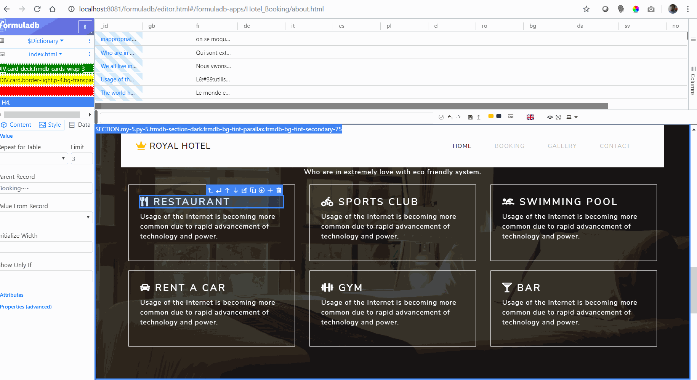

# How to start

Please read the instructions in this document.

Then start with this [example intro video test case](./src/frmdb-apps/Hotel_Booking/IntroVideo.scenario.ts). Then go back to this document any time things are unclear in this example.

# Selecting elements from the page

HTML is not like pen and paper where you put the pen wherever you want and start drawing. HTML is a collection of nested boxes similar to russian nested dolls :D.

Each box can be clicked and verified by *selecting* it first using a **selector**, please see below  the details about selectors. 

**Writing reliable selectors is the biggest challenge in writing these tests. Also you must chose selectors that are the least likely to change in the near future.**

FormulaDB editor itself can be used to browse through the boxes on the application page. 

Elements (boxes) inside the FormulaDB editor itself usually have a `title` or contain some text. It is preferable to *select* the elements by title or by text because this is what the user will see. The title will show up as a little tooltip if you hover with the mouse over an element:

Chrome DevTools (Press CTRL + Shift + I) can be used to browse the boxes in the FormulaDB Editor.

## Selectors 

1. CSS selectors: `tag-name#id.class-name[attribute="value]:nth-child(2)`
   1. A CSS selector has: tag name, id one or more classes separated by `.`, attributes and pseudo-classes separated by `:`
2. Elements in the main page are selected with plain CSS selectors
3. CSS selectors will not descend into iframes, you need `selector-inside-main-document iframe#id.or-something selector-inside-iframe`
4. CSS selectors will not descend into Shadow DOM, you need `selector-in-main-document frmdb-some-element::shadowRoot selector-inside-shadow-root`
5. CSS selectors do not allow you to select by text content, you need `some-selector:contains(some text)`. Text based selectors ar preferable because this is what the actual user will see. However contains selectors are slow and many times match multiple elements, you will probably need to add a class selector as well in your tests.
6. Another prefered selector is the title attribute `some-selector[title="title that the user sees on mouse over"]`. Again this is what the user will see as a tooltip when the mouse is over an element, most formuladb editor elements have a title.
7. CSS selectors do not allow you to select the parent of an element, you need `some-selector ::parent some-sibling`

# Tips & Tricks

* You cannot click and invisible `element`. `Click` automatically waits for the element to be visible and scolls the page if needed.

Special case: `.card .card-img-overlay` Selenium will not give an error, but will click on overlay and not on the card. Use `ClickWithJs` in such rare cases, **however** do not start using `ClickWithJs` everywhere, `Click` is the preferred way.

* ` :contains(some text)` is wrong, we need a selector, this is correct: `selector:contains(some text)` 

* You get the error `Failed: More than one element matches part-of-selector ...`. You need to be more specific, add conditions to your selector to make sure you match only one element on the page. If you cannot use `title` or `:contains` you can use the position of the element, e.g. `:nth-child(1)`

* `Click, SendKeys, Check...` all must be called with `await Speak(bla bla...`, `await Click(bla bla)`, if you don't use `await` all these actions will start in the same time!

* `FullTestWithVideo, Scenario, Step, StepWithVideo` are just a way to organize the test, they are called without `await`.

* To save time and not wait for the whole test to run each time you try someting, you can focus on just one or a few scenarios using `ScenarioFocused`. But don't forget to change back the `ScenarioFocused` to `Scenario` before you commit in git. The tests are considered `INCOMPLETE`, meaning failed, if you use `Focused`. `Focused` must be used only when you develop the test case and removed before you commit in gitlab.

    **WARNING** almost always also focus on the part wich does `GoTo(some page...)` in addition to the scenario you are working on, otherwise you will attempt to test an empty page!
